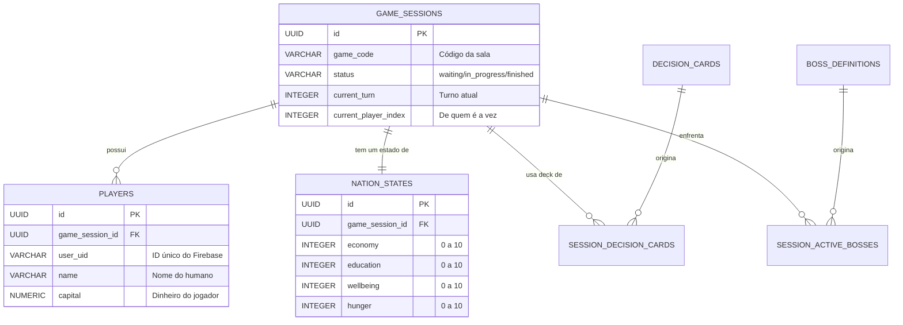

# 📄 Documentação Técnica Completa: API Brasil em Pauta

Bem-vindo à documentação oficial da API do jogo **Brasil em Pauta**. Este documento foi escrito para que qualquer pessoa, independentemente do seu nível de conhecimento técnico ou familiaridade com jogos, consiga entender exatamente como o sistema funciona, desde o banco de dados até as regras de negócio mais básicas.

---

## 🌍 1. Visão Geral
O **Brasil em Pauta** é um simulador de gestão política e social. Jogadores assumem papéis no governo e precisam tomar decisões (éticas ou corruptas) que afetam os indicadores de uma nação (Economia, Educação, Fome, etc.).

**URL Base da API:** `https://brasil-em-pauta.onrender.com`

---

## 📊 2. Diagrama Entidade-Relacionamento (ER)
O diagrama abaixo mostra como as "caixas" de informações (tabelas) se conectam. 
- Uma **Session** (Sessão) é o "quarto" onde o jogo acontece.
- Uma Sessão tem vários **Players** (Jogadores).
- Uma Sessão tem apenas uma **Nation** (Nação).



---

## 🗄️ 3. O Banco de Dados (As Regras de Ouro)

Aqui explicamos o que cada dado significa. Se um dado diz que é `0 a 10`, ele **nunca** poderá ser 11 ou -1.

### 3.1. Nation States (O Estado da Nação)
Cada partida tem um conjunto de atributos que definem se o país está indo bem ou mal. 
*   **Limitação de Escala:** Todos os valores abaixo obrigatoriamente ficam entre **0 (Caos)** e **10 (Perfeição)**.
*   **Economia:** Riqueza do país.
*   **Educação:** Nível de conhecimento do povo.
*   **Bem-estar:** Felicidade geral.
*   **Fome:** Se as pessoas estão comendo (0 é muita comida, 10 é muita fome).
*   **Apoio Popular:** O quanto o povo gosta do governo.

### 3.2. Game Sessions (A Sala de Aula)
*   **game_code:** Um código de 6 letras/números (ex: `AFG32X`). É como o nome da sala para seus amigos te acharem.
*   **status:** 
    *   `waiting`: A sala está aberta, mas ninguém começou a jogar ainda.
    *   `in_progress`: O jogo está rolando. Não entra mais ninguém.
    *   `finished`: O jogo acabou.

---

## 🕹️ 4. Fluxo do Jogo: Explicado para Leigos

Para que o jogo funcione, regras de "senso comum" são aplicadas rigorosamente pelo computador:

### 4.1. Criando e Entrando em uma Partida
1.  **Lotação Máxima:** Uma partida só suporta **4 jogadores**. 
    *   Se houver 1, 2 ou 3 jogadores, você **pode** entrar.
    *   Se houver 4 jogadores, a sala está cheia. Você **não pode** entrar. É como um carro de 5 lugares; o 6º passageiro não entra.
2.  **Início da Partida:** Para o jogo começar de verdade, a sala deve estar cheia ou o criador deve dar o comando. 
3.  **Unicidade:** Você não pode ser duas pessoas ao mesmo tempo na mesma sala. Se você já entrou, o sistema apenas te "reconecta".

### 4.2. O Sistema de Turnos (A sua vez)
O jogo funciona como um jogo de tabuleiro físico:
1.  Cada jogador recebe um número de índice (0, 1, 2 ou 3).
2.  Se o `current_player_index` for **0**, apenas o Jogador 0 pode clicar em botões de decisão.
3.  Se o Jogador 1 tentar jogar na vez do Jogador 0, a API responderá: *"Não é sua vez de jogar"*.
4.  Após o Jogador 0 jogar, o índice vira **1**. Quando o último jogador (ex: o 3º) joga, o índice volta para o **0** e o `current_turn` (Turno Atual) aumenta em 1.

---

## 🚀 5. Documentação da API (Endpoints)

Aqui estão os endereços que o site usa para conversar com o servidor.

### 🟢 A. Criar Partida
**Caminho:** `POST /game/create`
**O que faz:** Cria uma sala nova e coloca você como o "Presidente" (Dono).

*   **Corpo da Requisição (JSON):**
```json
{
  "userUid": "id_virebase_123",
  "playerName": "João"
}
```
*   **Regra Detalhada:** O sistema gera um código aleatório. Ele verifica se esse código já existe. Se existir, ele gera outro até ser único.

---

### 🔵 B. Entrar na Partida
**Caminho:** `POST /game/join`
**O que faz:** Tenta te colocar dentro de uma sala que já existe.

*   **Corpo da Requisição (JSON):**
```json
{
  "gameCode": "ABC123",
  "userUid": "id_firebase_456",
  "playerName": "Maria"
}
```
*   **Regras Obrigatórias (O "Não pode"):**
    *   Se o `gameCode` não existir -> **Erro: Partida não encontrada.**
    *   Se o `status` for `in_progress` -> **Erro: Jogo já começou.**
    *   Se já houver 4 jogadores -> **Erro: Sala cheia.**

---

### 🟡 C. Ver Estado do Jogo (Polling)
**Caminho:** `GET /game/:gameCode`
**O que faz:** O site pergunta para a API a cada segundo: "O que está acontecendo agora?".
*   **Exemplo:** `GET https://brasil-em-pauta.onrender.com/game/ABC123`
*   **Retorno:** O servidor envia de volta todos os dados da nação, a lista de jogadores e qual é a carta (dilema) atual.

---

### 🔴 D. Tomar uma Decisão
**Caminho:** `POST /game/decision`
**O que faz:** O jogador da vez escolhe entre o caminho **Ético** ou **Corrupto**.

*   **Corpo da Requisição (JSON):**
```json
{
  "gameCode": "ABC123",
  "userUid": "id_firebase_123",
  "choice": "ethical" 
}
```
*   **O que acontece por trás dos panos (Processamento):**
    1.  **Verificação de Identidade:** "É a vez do `userUid` que enviou isso?".
    2.  **Cálculo de Efeitos:** Se a escolha foi `corrupt`, o sistema olha na carta e vê, por exemplo: `Economia +2`, `Apoio Popular -3`, `Capital do Jogador +50`.
    3.  **Ajuste de Limites (Clamp):** Se a Economia era 9 e a carta dá +2, o resultado seria 11. O sistema **obrigatoriamente** trava em **10**.
    4.  **Passagem de Bastão:** O sistema desativa a carta atual e passa a vez para o próximo jogador da lista.

---

### 🔄 E. Reiniciar Partida
**Caminho:** `POST /game/restart`
**O que faz:** Apaga o progresso e volta para o começo.
*   **Regra de Segurança:** Apenas o jogador que criou a sala (`creator_user_uid`) pode apertar esse botão. Se outro tentar, o sistema nega.

---

## 🛠 6. Termos Técnicos para Iniciantes

*   **JSON:** É o formato de texto que o computador usa para organizar informações (usa chaves `{ }` e colchetes `[ ]`).
*   **UUID:** Um identificador universal. É um código gigante tipo `550e8400-e29b-41d4-a716-446655440000` que garante que nenhuma coisa seja confundida com outra.
*   **Endpoint:** É o "endereço" de uma função específica na internet.
*   **Middleware (CORS):** Uma camada de segurança que permite que o site acesse a API mesmo estando em endereços diferentes.
*   **Commit/Rollback:** 
    *   **Commit:** "Deu tudo certo, salva no banco".
    *   **Rollback:** "Ih, deu erro no meio do caminho! Cancela tudo e finge que nada aconteceu" (evita que o jogo fique quebrado ou pela metade).

---
**Fim da Documentação.** 
*Se você seguiu todos os passos, o país está em suas mãos (ou na sua conta bancária)!*
